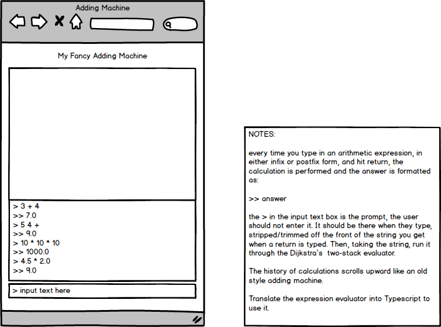

# Adding Machine - Happy Independence Day Weekend 2019.

For your long-weekend project, 
create an adding machine app that runs in a browser, in [Typescript](https://www.typescriptlang.org/), using Dijkstra’s two-stack evaluator. Your app needs have only one page, so carefully read the notes in the diagram below.

But first, you should `learn you some Typescript`. Read why it was created and why people use it. Find out how to implement a single page web using Typescript? Maybe a simple Typescript tutorial?

I've given you an app skeleton (which runs) and added the two components you need to wire and add behavior to. See `src/app/text-area` and `src/app/text-input`. If you use the builtin VSC terminal (see below), you can run the current app with `npm install` followed by `ng serve --open`, which will run the single page app and open a browser pointed at the app's main page. 

It should look something like this when you load the app's URL into a Chrome browser:


Notice the spaces in the inputs `( 4 + 5 )` - they are needed because of the simple
version of how we break it into token for the evaluator.

And you should use this evaluator (but first translate it into Typescript) for a start:
```java

public class Calculate {
    private Stack<String> ops  = new Stack<String>();
    private Stack<Double> vals = new Stack<Double>();

    public Calculate() { }
    
    public double run(String toEvaluate) {

        String[] tokens = toEvaluate.split(" ");
        for (String token : tokens) {
            if      (token.equals("("))               ;
            else if (token.equals("+"))    ops.push(token);
            else if (token.equals("-"))    ops.push(token);
            else if (token.equals("*"))    ops.push(token);
            else if (token.equals("/"))    ops.push(token);
            else if (token.equals("sqrt")) ops.push(token);
            else if (token.equals(")")) {
                String op = ops.pop();
                double v = vals.pop();
                if      (op.equals("+"))    v = vals.pop() + v;
                else if (op.equals("-"))    v = vals.pop() - v;
                else if (op.equals("*"))    v = vals.pop() * v;
                else if (op.equals("/"))    v = vals.pop() / v;
                else if (op.equals("sqrt")) v = Math.sqrt(v);
                vals.push(v);
            }
            else vals.push(Double.parseDouble(token));
        }
        return vals.pop();
    }
}
```
This is the class that requires spaces between every item in the string, so `( 4 + 5 )` which allows the evaluator to perform the complete calculation.

You should also translate the `Stack.java` class to typescript as well. I've given you an example of a stack in typescript. Can you make yours better?

You might wish to apply all your new fancy skills from doing the [YouAreEllClient](https://github.com/Zipcoder/ZCW-MesoLab-YouAreEllClient) lab.

## Node, npm & Angular

You probably need to install Node/NPM and Angular. [TS and Node install](https://dzone.com/articles/how-to-install-typescript-and-nodejs-typescript-tu-1)

You can install angular once you've installed TS and Node. 
`npm install -g @angular/cli`

## Visual Studio Code

I heartily recommend you download and use [Visual Studio Code](https://code.visualstudio.com/) as your IDE for this project. VSC has all kinds of cool Typescript tools (and it is in fact written in Typescript itself). VSC has many of the same features that IntelliJ has, so it should feel quite familiar. Once you have downloaded VSC, you can install Typescript itself, and then see all the magic VSC can do for you when working in Typescript. See [VSC Support For Typescript](https://code.visualstudio.com/Docs/languages/typescript)


## Thoughts about Typescript

As you learn Typsescript, you should be thinking about the similarities and differences with Java. We'll have a discussion on those ideas after the weekend.

-K
